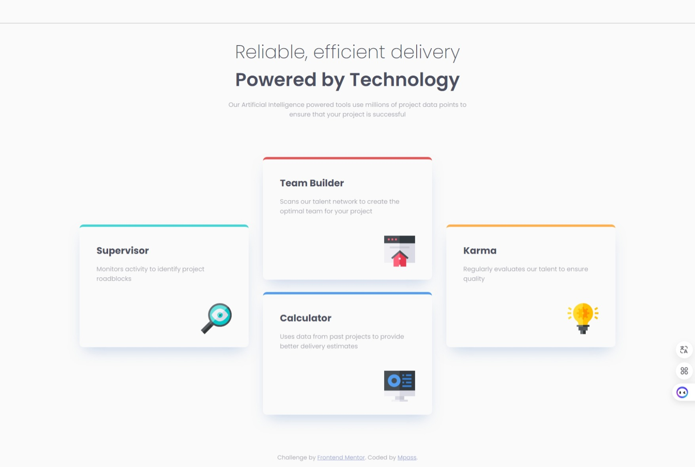
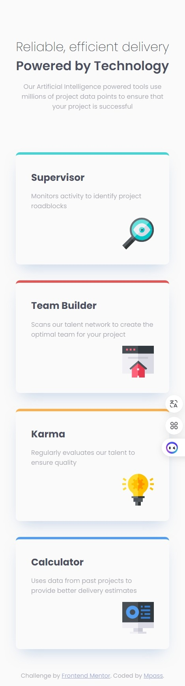

## Table of contents

- [Overview](#overview)
  - [The challenge](#the-challenge)
  - [Screenshot](#screenshot)
  - [Links](#links)
- [My process](#my-process)
  - [Built with](#built-with)
  - [What I learned](#what-i-learned)
  - [Continued development](#continued-development)
  - [Useful resources](#useful-resources)
- [Author](#author)

## Overview

### The challenge

Users should be able to:

- View the optimal layout depending on their device's screen size

### Screenshot

-Desktop

-Mobile

### Links

- Solution URL: [https://github.com/Benson0721/React-four-card]
- Live Site URL: [https://benson0721.github.io/React-four-card/]

## My process

### Built with

- Semantic HTML5 markup
- CSS custom properties
- CSS grid layout
- Flexbox
- Scss
- Postcss 
- Mobile-first workflow
- [React](https://reactjs.org/) - JS library

### What I learned
This is my first attempt at using grid layout. I prefer to use Flexbox for my website layout because I find grid to be more complex. However, in this practice, using Flexbox made it difficult to complete the layout as I wanted. I was pleasantly surprised to discover that grid can achieve this layout so simply. I'm really happy to have gained another skill in layout design, allowing me to tackle different layout challenges.

### Continued development

I want to get more familiar with react and grid layout, so I will keep practise that in the futrue practise!

### Useful resources

- [https://developer.mozilla.org/en-US/docs/Web/CSS/CSS_grid_layout/Basic_concepts_of_grid_layout] - This helped me for understanding how grid layout work.
- [https://ithelp.ithome.com.tw/articles/10231044]- This article give some idea about grid layout.

## Author

- Github - [Mpass](https://github.com/Benson0721)
- Frontend Mentor - [@Mpass](https://www.frontendmentor.io/profile/Benson0721)
